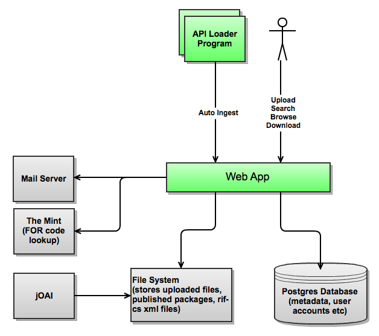

This document gives an overview of the system for future developers including those who may wish to reuse the application and/or contribute changes.

# Development Environment
See [Development Environment Setup](Development_Environment_Setup.md)

# Key Components
* Ruby on Rails application (the application has been tested on Apache with Passenger (mod_rails) running on Linux (CentOS), but can be run on your preferred deployment stack).
* Postgresql database (other databases can be supported).
* File system (for storage of uploaded data files)
* Access to an instance of [The Mint](https://sites.google.com/site/redboxmint/) for retrieval for FOR (field of research) codes. This can easily be replaced with an alternate lookup mechanism if desired.
* jOAI - the open source Java OAI provider for exposing the RIF-CS records over OAI-PMH

# Navigating The Code
DC21 is a Ruby on Rails application (3.1) so it follows the standard Rails application layout. Refer to the official [Rails guides](http://guides.rubyonrails.org/) if you need an explanation of the directory layout.
Some key libraries we use are:
* Devise (authentication)
* Cancan (authorisation)
* JQuery (javascript library)
* HAML (view templating - alternative to erb)
* SASS (css made easy)
* Capistrano (for deployments)

Refer to the Gemfile for a complete list of dependencies

# Automated Tests
DC21 has a full suite of RSpec and Cucumber tests. RSpec is used to unit test our code. Cucumber is used for acceptance testing. We elected not to write RSpec tests for views or controllers as these are very well covered by the Cucumber features.

Some of the libraries we use for testing are:
* RSpec
* Cucumber (with Capybara)
* Factory girl
* Email spec

# Guide For Contributing
We welcome any contributions to the code base. Please send us a pull request with your changes. Any changes should have accompanying RSpec examples and Cucumber features, and the full test suite should be passing.

# Component Diagram

